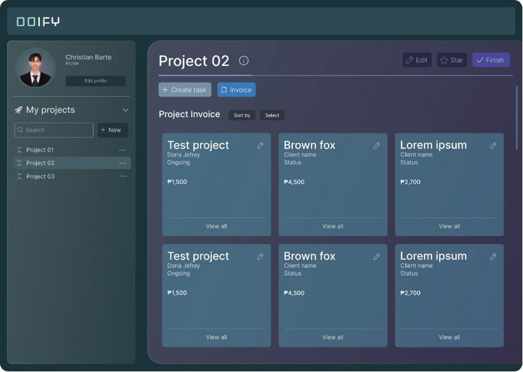
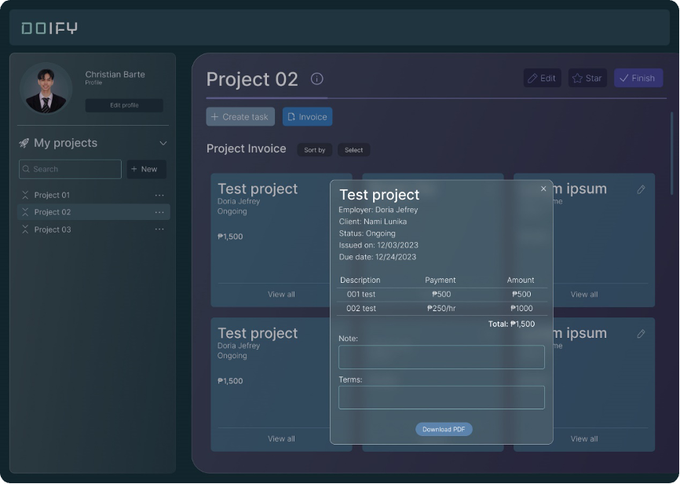

[READMEs](/READMES) > Automatic Invoice Generation

# Automatic Invoice Generation
The system should automatically generate invoices based on tracked data, ensuring accuracy and efficiency in the billing process.

### Invoice Automation
This is used to automatically generate invoices based on tracked data within Doify.

#### Input
* The authorized user shall access the invoicing section for a specific project.

#### Process
1. The authorized user shall select the project for which an invoice needs to be generated.
2. The system shall compile tracked hours and relevant project milestones for automated invoice generation.
3. The system shall generate an invoice and provide a preview for review.

#### Output 
* Accurate and efficient invoices are automatically generated based on tracked data.

#### Data Dictionary

| Element ID           | Element Text  | Element Type | Data Type | Required? |  Rules |
|:--------------------:|:-------------:|:------------:|:---------:|:---------:|:------:|
| InvoiceEdit          |               | Button       |           |           |        |
| InvoiceName          | ProjectName   | Header       |           |           |        |
| InvoiceEmployee      | Employee Name | Text         |           |           |        |
| InvoiceProjectStatus | Status        | Text         |           |           |        |
| InvoiceRate          |               | Integer      |           |           |        |
| InvoiceCards         |               | Cards        |           |           |        |
| InvoiceView          | View All      | Button       |           |           |        |
| InvoiceDescription   |               | Text         |           |           |        |
| InvoiceNote          | Note:         | Text         | Text      |           |        |
| InvoiceTerms         | Terms:        | Text         | Text      |           |        |
| InvoiceDownload      | Download PDF  | Button       |           |           |        |
