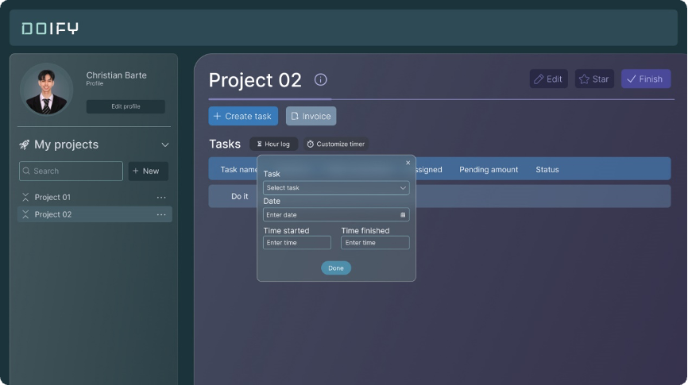

[READMEs](/READMES) > Hour Logging

# Hour Logging
Users should be able to log their working hours effortlessly, providing a simple interface with options to enter hours worked on specific tasks.

### Hour Logging
This is used to allow users to log their working hours effortlessly.

#### Input
* The user shall navigate to the time tracking section for a specific project.

#### Process
1. The user shall select the project and task for which hours need to be logged.
2. The user shall enter the number of hours worked or use a timer.
3. The system shall record the entered hours against the selected project and task.

#### Output 
* The logged hours are stored in the system and contribute to overall project tracking.

#### Data Dictionary

| Element ID      | Element Text | Element Type | Data Type | Required? | Rules |
|:---------------:|:------------:|:------------:|:---------:|:---------:|:-----:|
| TimeLog         | Hour Log     | Button       |           |           |       |
| TimeTaskSelect  | Select Task  | Dropdown     |           | Yes       |       |
| TimeTaskDate    | Enter Date   | Text         | Date      | Yes       |       |
| TimeTaskStarted | Time Started | Text         |           |           |       |
| TimeTaskEnded   | Time Ended   | Text         |           |           |       |
| TimeAdd         | Done         | Button       |           |           |       |

