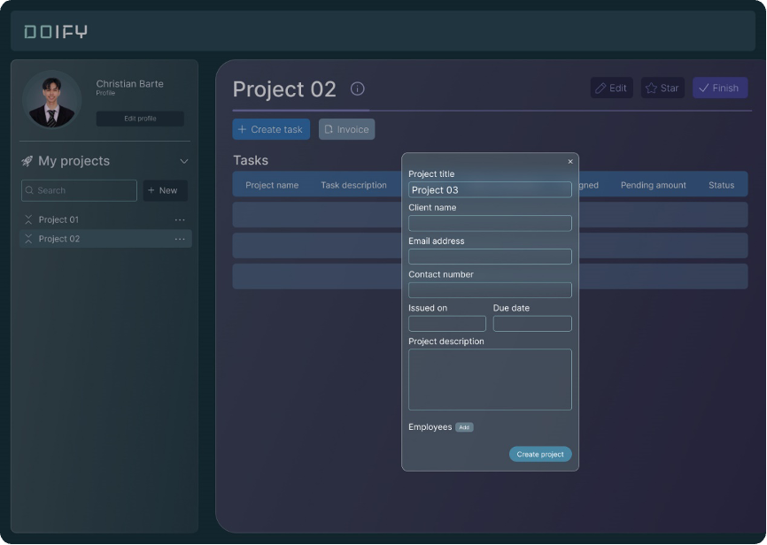

[READMEs](../README.md) > Project Creation

# Project Creation
Managers must be able to create projects, specifying objectives, deadlines, and relevant details for effective project management.

### New Project Setup
This is used to enable managers to create new projects within Doify.

#### Input
* An authorized user with manager privileges shall access the project management section.

#### Process
1.	 The authorized user shall initiate the creation of a new project.
2.	 The authorized user shall provide project details, including objectives and deadlines.
3.	 The system shall generate a unique identifier for the new project.

#### Output 
* A new project is created, and relevant details are stored in Doify.

#### Data Dictionary

|     Element ID     |           Element Text         | Element Type | Data Type | Required? |  Rules |
|        :---:       |              :---:             |     :---:    |   :---:   |   :---:   |  :---: |
|    ProjectTitle    |          Project Title         |     Text     |    Text   |    Yes    |        |
|     ClientName     |           ClientName           |     Text     |    Text   |    Yes    |        |
|    ClientEmailAd   |          Email Address         |     Text     |    Text   |    Yes    |        |
|   ClientContactNo  |          ContactNumber         |     Text     |  Integer  |           |        |
|  ProjectStartDate  |            IssuedOn            |     Text     |    Text   |           |        |
|   ProjectEndDate   |             DueDate            |     Text     |    Text   |           |        |
| ProjectDescription |       Project Description      |     Text     |    Text   |           |        |
| ProjectAddEmployee |            Employee            |    Button    |           |           |        |
|    ProjectCreate   |         Create Project         |    Button    |           |    Yes    |        |
| ProjectCreateError | Please fill up required fields |     Text     |           |           | Hidden |

