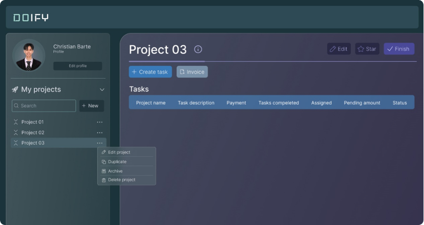
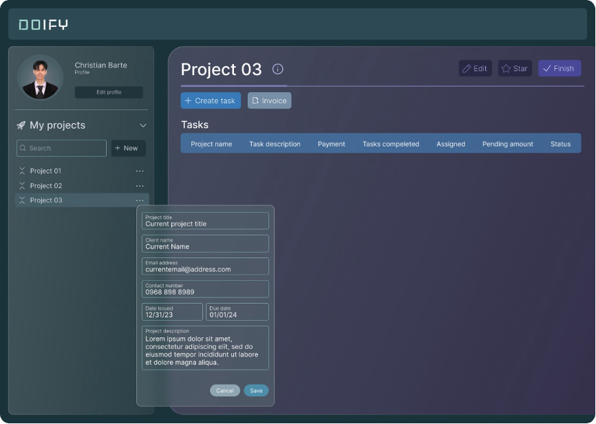
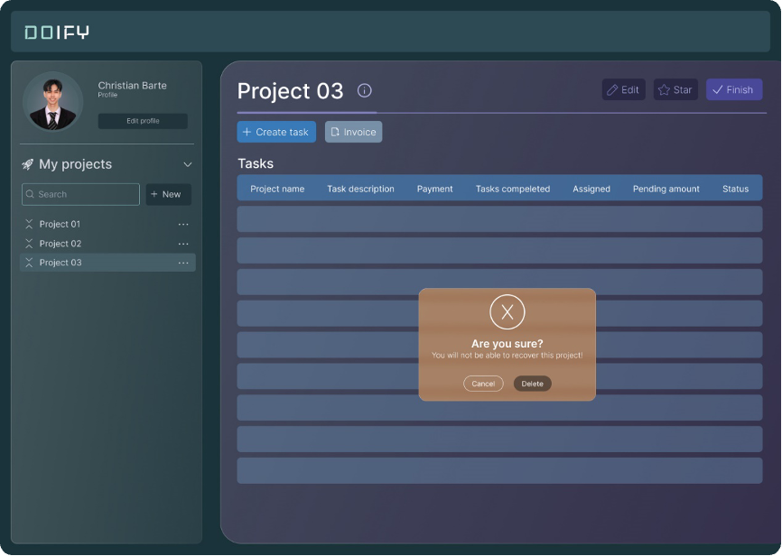

[READMEs](/READMES) > Project Management

# Project Management
The system provides a comprehensive set of tools and features to streamline project-related tasks and enhance collaboration among team members.

### Project Setup and Task Assignment
This is used to enable managers to efficiently manage projects, including creating new projects, assigning tasks, tracking work hours, and gaining insights through reporting and analytics.

#### Input
* An authorized user with manager privileges shall access the project management section

#### Process
1. The authorized user shall initiate the creation of a new project, providing project details.
2. Within the project, the user can create and assign tasks to team members, setting deadlines and priority.
3. Team members can utilize real-time tracking by starting timers or manually entering working hours.
4. Users can customize timers based on their preferences, enhancing flexibility in time tracking.

#### Output 
* New projects are created, and relevant details are stored.
* Assigned tasks are tracked and updated in the project management module.
* Accurate and up-to-date work hours contribute to billing andpayroll processes.
* Customized timers are available for users.
* Managers gain valuable insights for informed decision-making and strategic planning.

#### Data Dictionary

| Element ID         | Element Text                   | Element Type | Data Type | Required? |  Rules |
|:------------------:|:------------------------------:|:------------:|:---------:|:---------:|:------:|
| ProjectEdit        | Edit Project                   | Button       |           |           |        |
| ProjectDuplicate   | Duplicate                      | Button       |           |           |        |
| ProjectArchive     | Archive                        | Button       |           |           |        |
| ProjectDelete      | Delete                         | Button       |           |           |        |
| CreateTask         | CreateTask                     | Button       |           |           |        |
| TasksAssigned      | Tasks                          | Text         |           |           |        |
| ProjectStar        | Star                           | Button       |           |           |        |
| ProjectFinish      | Finish                         | Button       |           |           |        |
| ProjectInvoice     | Invoice                        | Button       |           |           |        |
| ProjectTitle       | Project Title                  | Text         | Text      | Yes       |        |
| ClientName         | ClientName                     | Text         | Text      | Yes       |        |
| ClientEmailAd      | EmailAddress                   | Text         | Text      | Yes       |        |
| ClientContactNo    | ContactNumber                  | Text         | Integers  |           |        |
| ProjectStartDate   | IssuedOn                       | Text         | Text      |           |        |
| ProjectEndDate     | DueDate                        | Text         | Text      |           |        |
| ProjectDescription | Project Description            | Text         | Text      |           |        |
| ProjectAddEmployee | Employee                       | Button       |           |           |        |
| ProjectCreate      | Create Project                 | Button       |           | Yes       |        |
| ProjectCreateError | Please fill up required fields | Text         |           |           | Hidden |
| ProjectEditError   | Please fill up required fields | Text         |           |           | Hidden |

