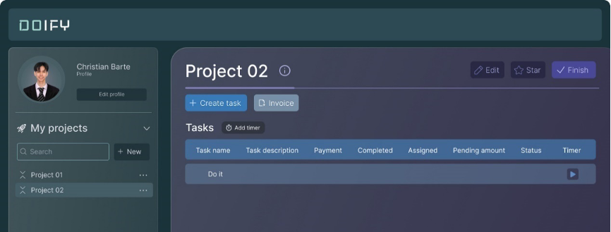

[READMEs](/READMES) > Real-Time Tracking

# Real-Time Tracking
Doify should support realtime tracking of work hours to reduce manual input, providing accurate and up-todate data for billing and payroll.

### Real-Time Work Tracking
This is used to support real-time tracking of work hours to reduce manual input.

#### Input
* The user shall initiate the tracking feature for a specific task.

#### Process
1. The user shall start the timer or manually enter the current working hours.
2. The system shall continuously update the tracked hours in realtime.
3. The user can stop the timer or adjust the tracked hours as needed.

#### Output 
*  Accurate and up-to-date work hours are recorded and contribute to billing and payroll processes.

#### Data Dictionary

| Element ID | Element Text | Element Type | Data Type | Required? |  Rules |
|:----------:|:------------:|:------------:|:---------:|:---------:|:------:|
| TimerStart |              | Button       |           |           |        |
| TimerPause |              | Button       |           |           |        |
| TimerStop  |              | Button       |           |           |        |
| TimeLog    | Time         | Text         |           |           |        |
