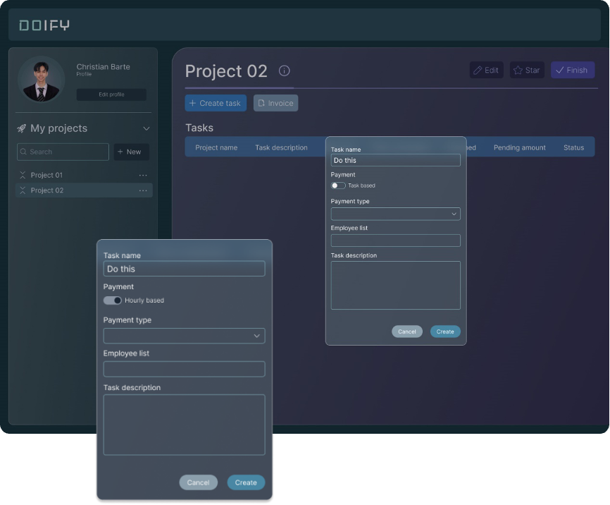

[READMEs](/READMES) > Task Assignment 

# Task Assignment
The system should allow managers to assign tasks to team members, including setting deadlines and tracking the progress of each task.

### Task Assignment
This is used to allow managers to assign tasks to team members within a project.

#### Input
* The authorized user shall navigate to the task management section for a specific project.

#### Process
1.	The authorized user shall create a new task within the project.
2.	The authorized user shall assign the task to a specific team member, setting deadlines and priority.
3.	The system shall notify the assigned team member about the new task.

#### Output 
* The task is assigned, and relevant details are updated in the project management module.

#### Data Dictionary

| Element ID | Element Text | Element Type | Data Type | Required? | Rules |
| :---: | :---: | :---: | :---: | :---: | :---: |
| TaskName | Task Name | Text | Text | Yes | |
| TaskPaymentType | PaymentType | Toggle Button | | Yes | |
| TaskPaymentMethod | PaymentMethod | Dropdown | | Yes | |
| TaskEmployee | Employee | Text | | | |
| TaskDescription | Task Description | Text | | | |
| TaskCancel | Cancel | Button | | | |
| TaskCreate | Create | Button | | | |
| TaskErrorCreating | Please fill out the required fields | Text | | | Hidden |
