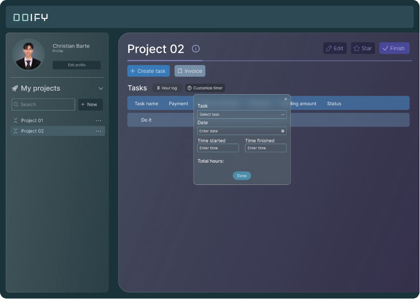

[READMEs](../README.md) > Timer Customization

# Timer Customization
Users must have the ability to set up timers based on their needs, providing flexibility in tracking time for different tasks and projects.

### Timer Configuration
This is used to allow users to set up timers based on their needs.

#### Input
* The user shall access the timer configuration settings in the user profile.

#### Process
1. The user shall customize timer settings, such as duration and reminders.
2. The system shall save the user's timer preferences.

#### Output 
* Customized timers are available for users, providing flexibility in tracking time for different tasks and projects.

#### Data Dictionary

| Element ID      | Element Text | Element Type | Data Type | Required? | Rules |
|:---------------:|:------------:|:------------:|:---------:|:---------:|:-----:|
| TimeLog         | Hour Log     | Button       |           |           |       |
| TimeTaskSelect  | Select Task  | Dropdown     |           | Yes       |       |
| TimeTaskDate    | Enter Date   | Text         | Date      | Yes       |       |
| TimeTaskStarted | Time Started | Text         |           |           |       |
| TimeTaskEnded   | Time Ended   | Text         |           |           |       |
| TimeAdd         | Done         | Button       |           |           |       |
| TimeTotal       | Total Hours  | Text         |           |           |       |

