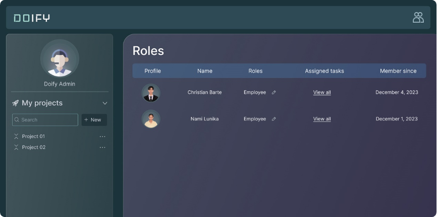

[READMEs](../README.md) > User Roles and Permissions

# User Roles and Permissions
Different user roles (e.g., admin, manager, employee) should have distinct permissions for accessing and modifying data within Doify.

### Role Assignment
An authorized user shall navigate to the user management section.

#### Input
* The authorized user shall access the invoicing section for a specific project.

#### Process
1. The authorized user shall select a user.
2. The authorized user shall assign a specific role (admin, manager, employee) to the selected user.
3. The system shall update the user's role and associated permissions.

#### Output 
* The selected user is assigned a new role, and their permissions are adjusted accordingly.

#### Data Dictionary

| Element ID        | Element Text   | Element Type | Data Type | Required? |  Rules |
|:-----------------:|:--------------:|:------------:|:---------:|:---------:|:------:|
| ProjectRoles      | Role           | Header       |           |           |        |
| ProjectProfiles   | Username       | Text         |           |           |        |
| ProjectContainer  | Profile Name   | Text         |           |           |        |
| ProjectMembers    | Member Details | Text         |           |           |        |
| ProjectMemberRole |                | Button       |           |           |        |
| ProjectMemberTask | View All       | Link         |           |           |        |
